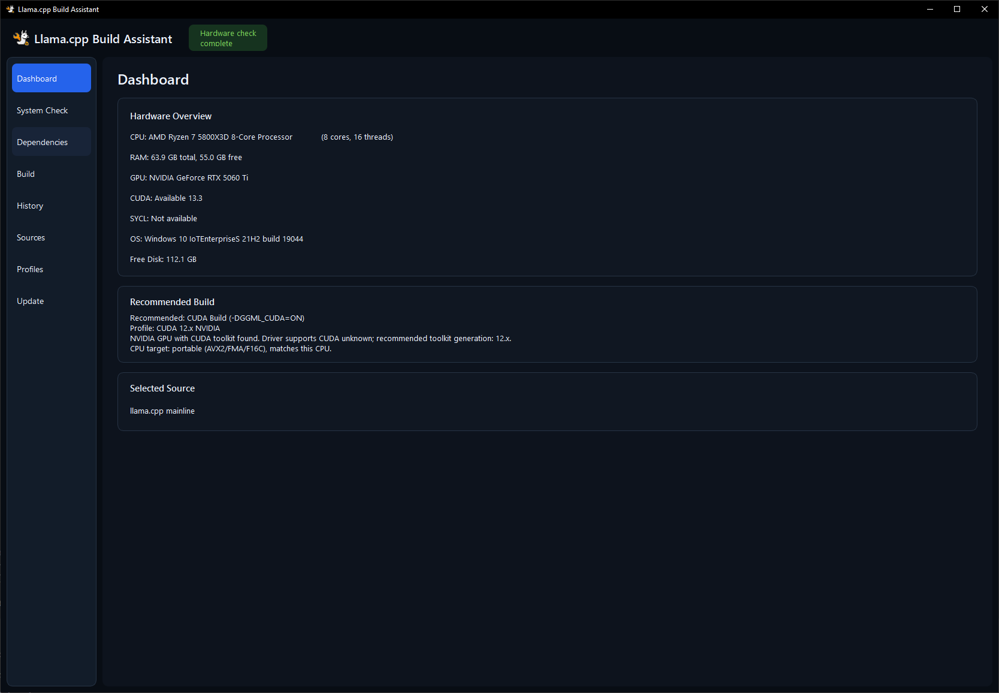
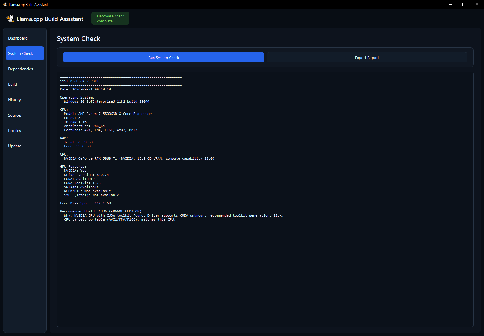
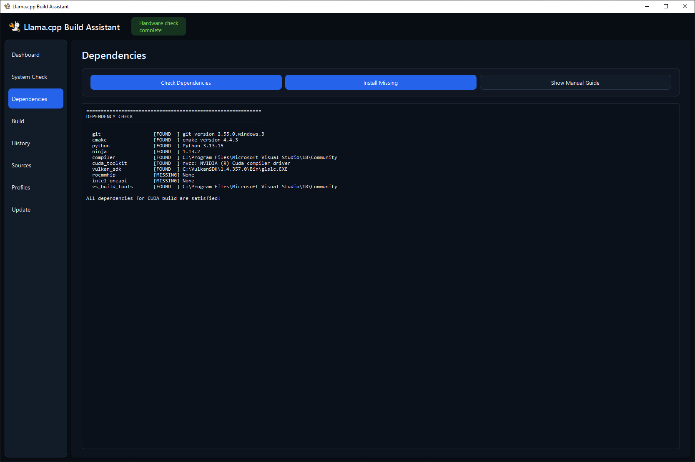
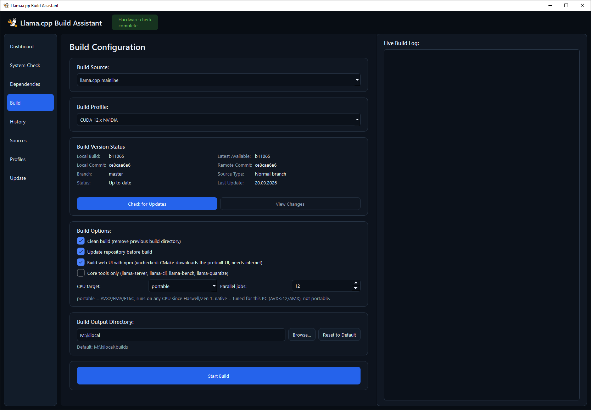

<p align="center"></p>

# Llama.cpp Build Assistant

A Python GUI application that automatically checks system hardware, ensures a
compatible Python toolchain, installs missing dependencies, and builds the
appropriate `llama.cpp` variant for **your** hardware — across **Windows 10/11,
macOS, Ubuntu and other Linux distros**.

## Features

- **Automatic Hardware Detection** — CPU, RAM, GPU, VRAM, CUDA, Vulkan, ROCm/HIP, SYCL, free disk
- **Dependency Checker / Auto-Install** — `winget` (Windows), `apt`/`dnf`/`pacman`/`zypper` (Linux), Homebrew (macOS)
- **Multiple Sources** — official + experimental `llama.cpp` forks, with automatic remote branch discovery for custom repositories
- **Build Profiles** — pre-configured profiles for quick setup
- **Custom Build Output** — choose and persist a build directory, with write-access and free-space checks
- **Build Version Status** — compare local and remote Git revisions and inspect new commits
- **Live Logs** — real-time build output
- **Build History** — all build results saved for reference

<h2>Screenshots</h2>

<table>
  <tr>
    <td width="50%">
      
    </td>
    <td width="50%">
      
    </td>
  </tr>
  <tr>
    <td width="50%">
      
    </td>
    <td width="50%">
      
    </td>
  </tr>
</table>

## Build Types

| Type | Backend | When to use |
|------|---------|-------------|
| CPU | `GGML_CPU` | No/disabled GPU, Intel Macs |
| CUDA 12.x | `GGML_CUDA` | NVIDIA, any GPU since Maxwell; driver 525+ |
| CUDA 13.x | `GGML_CUDA` | NVIDIA Turing or newer (compute capability 7.5+); driver 580+ |
| Vulkan | `GGML_VULKAN` | Any Vulkan GPU — **recommended for AMD RDNA4 (RX 9000 / AI PRO R9000)** |
| HIP/ROCm | `GGML_HIP` | AMD RDNA2/3 (use Vulkan for RDNA4); gfx target auto-detected |
| SYCL | `GGML_SYCL` | Intel GPU |
| Metal | `GGML_METAL` | Apple Silicon only (Intel Macs get CPU or Vulkan/MoltenVK) |

The hardware check picks the build type **and** the matching profile (for
example the CUDA generation your driver supports, or the Intel-Mac CPU
profile) and explains why on the dashboard.

**CPU target** (build tab): `portable` builds for AVX2/FMA/F16C so the binary
runs on any x86-64 CPU since Haswell/Zen 1; `native` lets llama.cpp enable
AVX-512/AMX for the machine that builds it. Profiles no longer pin the ISA.

**Output folders** follow the Auto-Tuner convention
`builds/<bNNNN>_<backend>_<suffix>/build/bin/…`, e.g.
`b10830_vulkan_llama.cpp`. `bNNNN` is `git rev-list --count HEAD`, the same
number `llama-server --version` prints. After the build the source tree is
retained together with Git metadata, web-UI assets, CMake projects, libraries,
and binaries. HIP builds bundle the ROCm runtime DLLs and link the
`rocblas/`/`hipblaslt/` kernel folders; CUDA builds bundle
`cudart`/`cublas`. Every build ends with `llama-server --version` and
`--list-devices` so a wrong backend is visible in the log.

## Supported Build Sources

| Source | Repository | Branch / PR | Folder suffix |
|--------|-----------|-------------|---------------|
| main | `ggml-org/llama.cpp` | `master` | `llama.cpp` |
| turboquant | `TheTom/llama-cpp-turboquant` | `master` (pinned commit) | `tq_llama.cpp` |
| PrismML Ternary/Bonsai | `PrismML-Eng/llama.cpp` | `prism` (pinned commit) | `2b_llama.cpp` |
| DeepSeek-OCR | `ggml-org/llama.cpp` | PR **#17400** (pinned commit) | `ocr_llama.cpp` |
| Diffusion-Gemma | `ggml-org/llama.cpp` | PR **#24427** (pinned commit) | `d_llama.cpp` |
| Custom | *user-defined* | — | `<id>_llama.cpp` (override with `dir_suffix`) |

> PR-based sources are fetched via `git fetch origin pull/<n>/head`, not plain
> clone. Pinned commits are stored in `data/sources.json`.

## Installation

### Quick start

**Windows** — double-click `start.bat` (picks the right Python, installs
deps, launches the GUI; no admin rights needed).

**macOS / Linux** — run:
```bash
./start.sh
```

### Manual

```bash
python python_manager.py bootstrap   # picks/installs a compatible interpreter
python -m pip install -r requirements.txt
python app.py
```

## Project Structure

```
├── app.py                   # Main GUI (CustomTkinter)
├── python_manager.py        # Cross-platform interpreter selection + install
├── hardware_check.py        # CPU/RAM/GPU/CUDA/Vulkan/ROCm/SYCL + RDNA4 detection
├── dependency_checker.py    # Dependency detection
├── dependency_installer.py  # Auto-install (winget/apt/dnf/pacman/zypper/brew)
├── builder.py               # Build orchestration (dispatches by platform)
├── repo_manager.py          # Git clone/update (PRs + submodules)
├── source_manager.py        # Build source management
├── profile_manager.py       # Build profile management
├── config.py                # Global config + default sources
├── logger.py                # Logging
├── build_llamacpp.ps1       # Windows build pipeline
├── build_llamacpp.sh        # macOS/Linux build pipeline
├── start.bat / start.sh     # Launchers (use python_manager)
├── data/                    # sources.json + profiles.json (history/report are generated)
└── pyproject.toml
```

## Requirements

- A C/C++ toolchain (VS Build Tools on Windows, GCC/Clang on Linux, Xcode/Clang on macOS)
- Git, CMake, Ninja
- A GPU backend toolkit when not building CPU-only (CUDA / Vulkan SDK / ROCm / Intel oneAPI)

## Testing

```bash
python -m pip install -e ".[dev]"
pytest
```

The tests cover the recommendation logic with synthetic hardware reports
(RDNA4 detection, CUDA 12/13 selection, Apple Silicon vs. Intel Mac) and
run on any platform.

## Changelog

### 2.3.6

- Added asynchronous remote branch discovery for custom build sources using
  `git ls-remote`, including repository default-branch detection, refresh,
  custom refs, validation, and offline/error fallback.
- Replaced the branch field with a fast searchable selector that remains
  responsive with large repositories. Background Git queries no longer open a
  console window on Windows.
- Reorganized Build Configuration: Build Version Status now follows the
  selected profile, uses a compact four-row/two-column layout, and Build Output
  Directory appears below Build Options.
- The npm web-UI checkbox is disabled whenever the selected profile explicitly
  sets `LLAMA_BUILD_UI=OFF`.
- Improved dashboard recommendation alignment and status coloring.

### 2.3.5

- Removed the Update Source button and its GUI update workflow from Build
  Version Status.
- Kept asynchronous version checks, update-availability reporting, and the
  View Changes dialog intact.

### 2.3.4

- Added a persistent custom build output directory with Browse and Reset to
  Default controls, write-access checks, and free-space validation.
- Added asynchronous Git-based version status for branches, forks, custom
  sources, pinned commits, and pull requests.
- Added local/remote commits, build numbers, commit differences, branch and PR
  information, last-update dates, and a commit changes dialog.
- Recorded the exact build number, commit SHA, and branch in build history.
- Added regression coverage for settings, output routing, source-version
  checks, source updates, and history metadata.

### 2.3.3

- Added row-based CMake flag editing with add/remove controls and improved
  multiline profile editing with automatic dialog resizing.
- Added the CUDA 13.x NVIDIA profile for PrismML.
- Added K2Horizon.cpp and beellama.cpp build sources.
- Updated PrismML to track the current `prism` branch instead of a pinned
  commit and increased the build-source dialog height.

### 2.3.2

- Preserved profile CMake flags losslessly on Windows by encoding each flag as
  an individual command-line value.
- Normalized multiline custom flags, logged the effective profile flags, and
  ensured user flags retain precedence over build defaults.
- Added regression coverage for flags containing spaces and semicolons.

### 2.3.1

- Preserved complete llama.cpp source checkouts and build trees instead of
  trimming successful builds to `build/bin`.
- Built the complete tools/examples/test output, provisioned web-UI assets,
  and bundled required CUDA runtime dependencies.
- Tightened post-build backend verification and output-directory selection so
  a build cannot accidentally reuse binaries from another checkout.
- Added regression coverage for checkout preservation, UI layouts, CUDA DLL
  deployment, backend verification, and profile migration.

### 2.3.0

- Hardware check: CPUID feature detection on Windows fixed (the machine code
  clobbered the output pointer, so features were always empty); real VRAM
  for AMD/Intel on Windows (registry `qwMemorySize` instead of the 4 GB
  `AdapterRAM` cap); RDNA4 detected via `hipInfo` gfx target and a wider
  name list (Radeon AI PRO R9700 included); NVIDIA driver CUDA version and
  compute capability reported.
- Recommendation: separate CUDA 12.x / 13.x profiles chosen from driver and
  GPU generation; Apple Silicon → Metal, Intel Mac → CPU (Metal is not
  maintained for x86 Macs upstream); the dashboard explains the choice.
- Profiles: no hard-coded `GPU_TARGETS=gfx1201`, no ISA flags, no forced
  npm web-UI build. Untouched v2.2 default profiles are migrated once.
- Build script (Windows): HIP builds import the VS developer environment,
  detect the gfx target with `hipInfo`, apply the HIP SDK 7.2 / MSVC 14.5x
  `<cmath>` header fix (LLVM PR #201563) in a private copy under `deps/`,
  and bundle the ROCm runtime; CUDA picks the toolkit by generation, checks
  the driver, sets `CMAKE_CUDA_ARCHITECTURES` from the installed GPUs and
  bundles cudart/cublas; SPIRV-Headers cache works (wrong marker path);
  no Chocolatey install, no global `git config`; Ninja from the VS bundle;
  parallel jobs default to the CPU count; UTF-8 log output.
- Folder names use `git rev-list --count HEAD` (matches
  `llama-server --version`) and the Auto-Tuner suffixes (`_llama.cpp`).
- GUI: "Clean build" / "Update repository" checkboxes are honoured (profiles
  only pre-fill them); CPU target, parallel jobs and "core tools only"
  options; post-build verification (`--version`, `--list-devices`) and the
  actual error lines on failure.
- Dependency check: HIP found via `HIP_PATH`/Program Files, Vulkan via
  `glslc`, Ninja via the VS bundle, no `winget list` calls.
